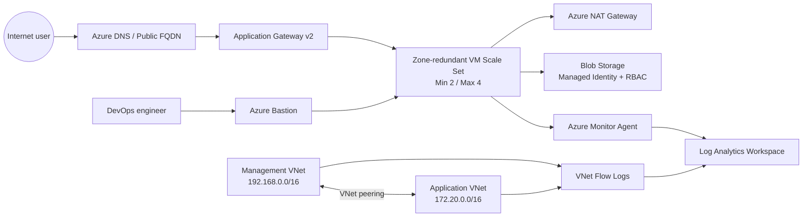

# DevOps Project 02 — Azure Modular and Scalable Network Architecture

Triển khai website Apache trên kiến trúc Azure có tính sẵn sàng cao và tự động mở rộng. Bản Azure giữ nguyên concept của project AWS ban đầu: tách mạng quản trị và ứng dụng, kết nối private, compute nằm trong private subnet, outbound qua NAT, public Layer 7 load balancing, bastion, object storage, DNS và giám sát tập trung.

## Kiến trúc



### Ánh xạ công nghệ

| AWS ban đầu | Azure triển khai |
|---|---|
| VPC / Subnet / Security Group | VNet / Subnet / Network Security Group |
| Transit Gateway | Hub-spoke VNet peering; dùng Virtual WAN Hub khi mở rộng nhiều spoke |
| Internet Gateway | Public IP và Azure system routes |
| NAT Gateway | Azure NAT Gateway |
| Bastion EC2 + Elastic IP | Azure Bastion + Standard Public IP |
| AMI / Launch Template | Azure Compute Gallery image / VMSS model |
| EC2 Auto Scaling Group | Zone-redundant Virtual Machine Scale Sets + Autoscale |
| Application Load Balancer / Target Group | Application Gateway v2 / Backend Pool |
| Route 53 | Azure DNS |
| S3 + IAM Role | Blob Storage + Managed Identity + Azure RBAC |
| CloudWatch Agent / Logs / Metrics | Azure Monitor Agent + DCR + Log Analytics |
| VPC Flow Logs | Network Watcher VNet Flow Logs + Traffic Analytics |
| SSM Session Manager | Azure Bastion; Run Command cho thao tác vận hành |

> CIDR ứng dụng được đổi từ `172.32.0.0/16` thành `172.20.0.0/16` vì `172.32.0.0/16` không thuộc dải private RFC1918.

## Cấu trúc artifact

```text
DevOps-Project-02/
├── Azure Architecture/
│   ├── bootstrap.sh                 # Bootstrap Apache cho VMSS
│   ├── main.bicep                   # Hạ tầng Azure chính
│   ├── flow-logs.bicep              # VNet Flow Logs dùng Network Watcher hiện có
│   └── main.parameters.example.json # Parameters mẫu, không chứa secret
└── html-web-app/                     # Toàn bộ website được deploy lên Apache
```

## Tiền điều kiện

1. Azure subscription và quyền tạo resource/role assignment trong resource group ứng dụng. Để bật Flow Logs, principal triển khai cũng cần quyền tạo `Microsoft.Network/networkWatchers/flowLogs` và nested deployment trong `NetworkWatcherRG`.
2. Azure CLI và Bicep CLI.
3. SSH public key.
4. Azure Compute Gallery image version dựa trên Ubuntu 22.04 hoặc 24.04, có Azure Linux Agent đang hoạt động và **Azure CLI phiên bản đã pin sẵn trong image**. Bootstrap được chạy bằng Custom Script Extension nên không phụ thuộc cloud-init. Với production, nên bake cả Apache/Git vào image bằng Azure VM Image Builder hoặc Packer để giảm thời gian scale-out và kiểm soát supply chain.
5. Region và VM SKU hỗ trợ các Availability Zone đã khai báo. Nếu region chỉ có một phần zone, sửa `availabilityZones` trong parameters.

## Triển khai

### 1. Chuẩn bị Golden Image

Tạo Ubuntu VM, harden OS, cài Azure Linux Agent và một phiên bản Azure CLI cố định, sau đó publish version vào Azure Compute Gallery. Gán resource ID của image version vào `galleryImageVersionId`. Đây là phần tương đương Golden AMI trong thiết kế cũ. Không tải installer Azure CLI động trong quá trình scale-out; cập nhật CLI bằng cách tạo image version mới đã được kiểm soát.

### 2. Tạo parameters

```bash
cd "DevOps-Project-02/Azure Architecture"
cp main.parameters.example.json main.parameters.json
```

Thay `sshPublicKey`, `galleryImageVersionId`, region/SKU/zone và repository nếu cần. Không commit `main.parameters.json` khi file chứa dữ liệu môi trường thật.

### 3. Validate và triển khai hạ tầng

```bash
az group create --name rg-devops-project-02 --location southeastasia
az bicep build --file main.bicep
az deployment group validate \
  --resource-group rg-devops-project-02 \
  --template-file main.bicep \
  --parameters @main.parameters.json
az deployment group create \
  --name devops-project-02 \
  --resource-group rg-devops-project-02 \
  --template-file main.bicep \
  --parameters @main.parameters.json
```

Template tạo hai VNet, peering private, Azure Bastion, NAT Gateway, Application Gateway v2, private VMSS min 2/max 4, Storage Account không cho public/shared-key access, user-assigned Managed Identity được cấp `Storage Blob Data Reader` chỉ tại container `app-config` trước khi VMSS được tạo, Azure Monitor Agent, DCR memory/CPU/syslog, Log Analytics và Azure DNS tùy chọn.

`bootstrap.sh` được nhúng vào VMSS Custom Script Extension, vì vậy trạng thái thực thi được Azure Resource Manager theo dõi và không phụ thuộc cloud-init. Script clone repository rồi copy **toàn bộ** `html-web-app` (HTML, CSS, JS và images) vào `/var/www/html`; endpoint `/healthz` được dùng cho Application Gateway probe. Bootstrap output và Apache access/error logs được gửi vào syslog để Azure Monitor Agent thu thập tập trung.

### 4. Bật VNet Flow Logs

Network Watcher thường được Azure quản lý theo region trong `NetworkWatcherRG`, nên Flow Logs được tách thành deployment riêng. Lấy output của deployment chính và workspace GUID:

```bash
APP_VNET_ID=$(az deployment group show -g rg-devops-project-02 -n devops-project-02 --query properties.outputs.applicationVnetId.value -o tsv)
MGMT_VNET_ID=$(az deployment group show -g rg-devops-project-02 -n devops-project-02 --query properties.outputs.managementVnetId.value -o tsv)
LAW_ID=$(az deployment group show -g rg-devops-project-02 -n devops-project-02 --query properties.outputs.logAnalyticsWorkspaceId.value -o tsv)
LAW_GUID=$(az monitor log-analytics workspace show --ids "$LAW_ID" --query customerId -o tsv)
STORAGE_NAME=$(az deployment group show -g rg-devops-project-02 -n devops-project-02 --query properties.outputs.configStorageAccountName.value -o tsv)
STORAGE_ID=$(az storage account show -g rg-devops-project-02 -n "$STORAGE_NAME" --query id -o tsv)
```

Triển khai Flow Logs (đổi tên Network Watcher/region nếu cần):

```bash
az deployment group create \
  --name devops-project-02-flow-logs \
  --resource-group rg-devops-project-02 \
  --template-file flow-logs.bicep \
  --parameters \
    networkWatcherName=NetworkWatcher_southeastasia \
    virtualNetworkResourceIds="[\"$MGMT_VNET_ID\",\"$APP_VNET_ID\"]" \
    storageAccountResourceId="$STORAGE_ID" \
    logAnalyticsWorkspaceResourceId="$LAW_ID" \
    logAnalyticsWorkspaceId="$LAW_GUID" \
    logAnalyticsWorkspaceRegion=southeastasia
```

### 5. Delegate Azure DNS (khi dùng custom domain)

Nếu `dnsZoneName` không rỗng, lấy nameserver do deployment tạo:

```bash
az deployment group show \
  --resource-group rg-devops-project-02 \
  --name devops-project-02 \
  --query properties.outputs.dnsNameServers.value \
  --output table
```

Cập nhật các NS record tại registrar hoặc parent DNS zone để delegate domain sang các nameserver này. Sau khi DNS propagate, kiểm tra bằng `dig NS <domain>` và `dig A <domain>` từ public resolver. Nếu không delegate, DNS zone và apex A record trong Azure tồn tại nhưng Internet sẽ không resolve qua zone đó.

## Bảo mật

- VMSS không có public IP; SSH chỉ được phép từ `AzureBastionSubnet`.
- HTTP backend chỉ được phép từ Application Gateway subnet.
- Blob public access và shared-key authorization bị tắt; VMSS dùng Managed Identity/RBAC.
- App subnet dùng NAT Gateway cho controlled outbound.
- Password authentication bị tắt.
- Baseline lab mở HTTP port 80 để giữ scope tương đương project cũ. Production nên cấu hình HTTPS listener/certificate trong Application Gateway, redirect HTTP sang HTTPS và cân nhắc `WAF_v2`.
- VNet peering phù hợp với đúng hai VNet. Khi có nhiều spoke hoặc cần routing transit quy mô lớn, thay lớp kết nối bằng Azure Virtual WAN Hub mà không thay app tier.

## Validation

1. **IaC:** `az bicep build --file main.bicep` và `az bicep build --file flow-logs.bicep` không lỗi.
2. **Private administration:** mở VMSS instance bằng Azure Bastion; không có public IP trên instance.
3. **Bootstrap:** xác nhận extension `ConfigureApplication` ở trạng thái `ProvisioningState/succeeded`, sau đó kiểm tra `/var/log/azure-bootstrap.log`, `systemctl status apache2` và `curl http://127.0.0.1/healthz`.
4. **Public path:** lấy output `applicationUrl`, mở URL và xác nhận CSS/JS/images tải thành công.
5. **High availability:** Application Gateway backend health báo Healthy; VMSS có ít nhất 2 instance phân bổ theo zone.
6. **Autoscale:** xác nhận Autoscale setting có min 2/max 4 và hai rule CPU.
7. **Observability:** query `Perf` cho CPU/memory và chạy `Syslog | where ProcessName in ("azure-bootstrap", "apache-access") or Facility == "local1"` để xác nhận bootstrap/Apache logs; xác nhận VNet Flow Logs xuất hiện trong Storage/Traffic Analytics.
8. **Storage:** từ VMSS, `az login --identity --client-id <managed-identity-client-id>` và đọc blob trong `app-config` được; truy cập container khác, account key hoặc public anonymous đều bị từ chối.

## Lưu ý ứng dụng

Website hiện là static site. `WEB-INF/web.xml` và form `contact.php` là artifact cũ nhưng repository không có servlet/PHP backend tương ứng; migration này giữ nguyên source và không giả định một backend chưa tồn tại.

## Tài liệu Azure tham khảo

- [Virtual network flow logs](https://learn.microsoft.com/en-us/azure/network-watcher/vnet-flow-logs-overview)
- [Deploy a VMSS across Availability Zones](https://learn.microsoft.com/en-us/azure/virtual-machine-scale-sets/virtual-machine-scale-sets-use-availability-zones)
- [Azure Bastion architecture](https://learn.microsoft.com/en-us/azure/bastion/bastion-overview)
- [Application Gateway infrastructure configuration](https://learn.microsoft.com/en-us/azure/application-gateway/configuration-infrastructure)
- [Custom Script Extension for Linux](https://learn.microsoft.com/en-us/azure/virtual-machines/extensions/custom-script-linux)
- [Azure Monitor Agent data collection](https://learn.microsoft.com/en-us/azure/azure-monitor/agents/azure-monitor-agent-data-collection)

Nội dung tham khảo đã được diễn giải lại để tuân thủ giới hạn cấp phép (Content was rephrased for compliance with licensing restrictions).
