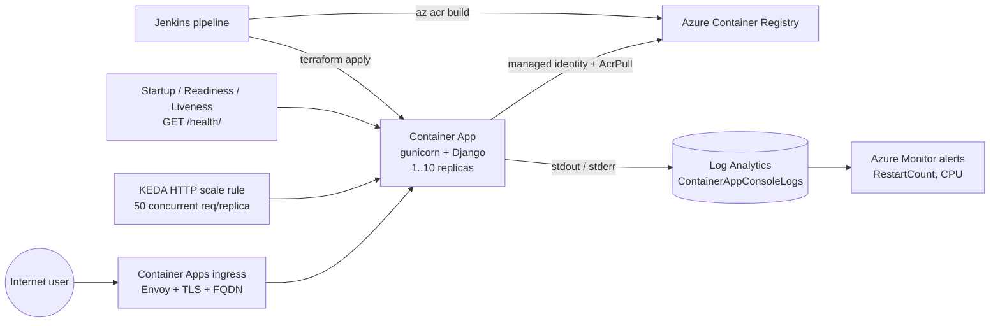
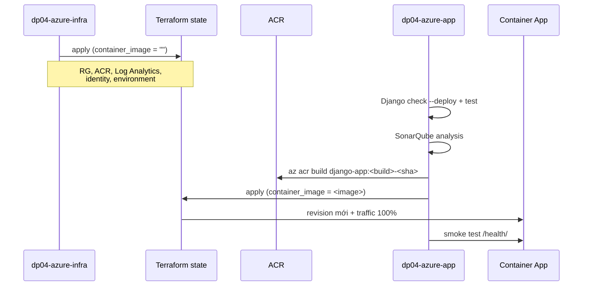

# DevOps Project 04 — Azure: Django trên Azure Container Apps

Bản triển khai Azure cho cùng ứng dụng Django trong project này. Giữ nguyên concept của bản AWS (container hóa → registry → orchestrator serverless → load balancer → autoscale → log tập trung), thay ECS/ECR bằng Container Apps/ACR.

Bản AWS (`../README.md`, `../Dockerfile`) **không bị thay đổi**. Hai bản tồn tại song song và không dùng chung file cấu hình nào.

Có hai cách triển khai Azure, chọn một:

| Track | Dùng khi | Điểm vào |
|---|---|---|
| **Bicep** | Triển khai tay, demo nhanh, một máy một lệnh | `bicep/deploy.sh` |
| **Terraform + Jenkins** | Dùng lại bộ CI/CD của DevOps-Project-01 (Jenkins, SonarQube, state trên Azure Storage) | `Jenkinsfile.infra` → `Jenkinsfile.app` |

Cả hai track dùng **chung** phần app trong `app/` (Dockerfile, settings, requirements), nên image sinh ra là như nhau. Mỗi track deploy vào resource group riêng (`devops04-django-rg` cho Bicep, `<env>-django-app-rg` cho Terraform) nên có thể chạy song song mà không tranh resource của nhau.

## Kiến trúc



### Ánh xạ AWS → Azure

| Bản AWS (README gốc) | Bản Azure |
|---|---|
| Amazon ECR | Azure Container Registry |
| ECS cluster (Fargate) | Container Apps environment (workload profile Consumption) |
| ECS task definition | `template` + `container` block của container app |
| ECS service + rolling deploy | Revision (`Single` mode, traffic 100% về revision mới) |
| Application Load Balancer + Target Group | Ingress tích hợp của Container Apps (Envoy, TLS sẵn) |
| Application Auto Scaling (target tracking) | KEDA HTTP scale rule (`concurrentRequests`) |
| CloudWatch Logs (`awslogs` driver) | Log Analytics (`ContainerAppConsoleLogs_CL`) |
| CloudWatch Alarms | Azure Monitor metric alerts + action group |
| `ecsTaskExecutionRole` (IAM) | User-assigned managed identity + role `AcrPull` |
| Secrets Manager / env var | Container app `secret` (có thể trỏ Key Vault) |
| ECR lifecycle policy | ACR retention policy (chỉ SKU Premium) |
| ECR scan on push | Microsoft Defender for Containers (bật ở mức subscription) |
| VPC + subnet + security group | Không cần cho bản này; thêm VNet-integrated environment khi cần private |
| RDS | Azure Database for PostgreSQL Flexible Server (xem "Bước tiếp theo") |

### Bản Azure sửa 4 lỗi của bản AWS

Bản AWS hiện tại không chạy được nếu build thật; phía Azure xử lý trong `app/`, không sửa file AWS:

| Vấn đề ở bản AWS | Cách bản Azure xử lý |
|---|---|
| `Dockerfile` trỏ `myproject.settings.production` / `myproject.wsgi` trong khi package thật là `hello_world_django_app` | `app/Dockerfile` trỏ đúng `hello_world_django_app.settings_azure` / `hello_world_django_app.wsgi` |
| `requirements.txt` chỉ có `django`, thiếu `gunicorn` | `app/requirements.txt` pin `Django`, `gunicorn`, `whitenoise` |
| `settings.py` không có `STATIC_ROOT` → `collectstatic` fail | `app/settings_azure.py` set `STATIC_ROOT` + WhiteNoise (đã verify: 127 file static được collect) |
| Không có route `/health/` nhưng health check lại gọi `/health/` | `app/urls_azure.py` thêm `/health/` (và cả `/` trả Hello World) |

## Cấu trúc

```text
DevOps-Project-04/
├── README.md                     # Bản AWS (ECS + ECR), không đổi
├── Dockerfile                    # Bản AWS, không đổi
├── manage.py, hello_world_django_app/, requirements.txt   # App dùng chung
└── azure/
    ├── README.md                 # File này
    ├── app/                      # Phần app riêng cho Azure (dùng cho cả 2 track)
    │   ├── Dockerfile            # Build context = DevOps-Project-04/
    │   ├── requirements.txt      # Django + gunicorn + whitenoise (pinned)
    │   ├── settings_azure.py     # Production settings, đọc từ env
    │   └── urls_azure.py         # Thêm /health/ cho probe
    ├── bicep/
    │   ├── platform.bicep        # ACR + Log Analytics + environment + identity
    │   ├── app.bicep             # Container app (revision, ingress, probes, scale)
    │   ├── *.parameters.example.json
    │   └── deploy.sh             # platform → az acr build → app → smoke test
    ├── terraform/
    │   ├── main.tf               # RG + identity + environment + modules
    │   ├── variables.tf, outputs.tf, terraform.tfvars.example
    │   └── modules/{registry,monitoring,container_app}
    ├── Jenkinsfile.infra         # Terraform: plan → approval → apply
    └── Jenkinsfile.app           # checks → sonar → az acr build → approval → apply → smoke test
```

## Tiền điều kiện

1. Azure subscription, quyền tạo resource **và role assignment** trong resource group đích (cần cho AcrPull/AcrPush).
2. Provider `Microsoft.App` đã được đăng ký: `az provider register --namespace Microsoft.App`.
3. Azure CLI (track Bicep) hoặc Terraform ≥ 1.0 + Azure CLI (track Terraform).
4. Không cần Docker local: image được build bằng ACR Tasks (`az acr build`).

---

## Track 1 — Bicep (triển khai tay)

```bash
cd DevOps-Project-04/azure/bicep

# Sinh SECRET_KEY một lần rồi giữ lại cho các lần deploy sau
export DJANGO_SECRET_KEY="$(python3 -c 'import secrets; print(secrets.token_urlsafe(64))')"

RESOURCE_GROUP=devops04-django-rg LOCATION=southeastasia ./deploy.sh
```

Script làm đúng thứ tự bắt buộc: `platform.bicep` (tạo ACR) → `az acr build` (đẩy image) → `app.bicep` (tạo revision) → smoke test `/health/`. Không đảo được thứ tự vì container app không thể pull image chưa tồn tại.

Deploy version mới: chạy lại với `IMAGE_TAG` khác. Mỗi tag tạo một revision mới, rollback bằng cách deploy lại tag cũ.

Chạy từng bước bằng `az` nếu muốn kiểm soát chi tiết:

```bash
az deployment group create -g devops04-django-rg --template-file platform.bicep \
  --parameters @platform.parameters.example.json
az acr build --registry <acr> --image django-app:1.0.0 --file azure/app/Dockerfile ../..
az deployment group create -g devops04-django-rg --template-file app.bicep \
  --parameters @app.parameters.example.json containerImage=<acr>.azurecr.io/django-app:1.0.0 \
               djangoSecretKey="$DJANGO_SECRET_KEY"
```

---

## Track 2 — Terraform + Jenkins (dùng môi trường DevOps-Project-01)

Tái sử dụng nguyên bộ công cụ của Project-01, không cần dựng thêm gì:

| Thành phần | Dùng lại như thế nào |
|---|---|
| Jenkins `dp01/jenkins` (`dp01-jenkins`) | Đã có Terraform 1.9.8 + Azure CLI + Docker CLI |
| SonarQube `dp01-sonarqube` trên network `dp01-cicd` | `Jenkinsfile.app` phân tích project key `devops-project-04` |
| Azure Storage `hddevopsprojectstg001` (`tfstate-rg`/`tfstate`) | State riêng theo key `django-app/terraform.tfstate` |
| Credentials `azure-sp`, `azure-tenant`, `azure-subscription`, `sonarqube-token` | Dùng y nguyên |

**Cần thêm 1 credential duy nhất:**

| ID | Loại | Nội dung |
|---|---|---|
| `django-secret-key` | Secret text | `python3 -c 'import secrets; print(secrets.token_urlsafe(64))'` |

> Jenkins image của Project-01 không có Python, cũng không có sonar-scanner CLI. `Jenkinsfile.app` xử lý bằng cách chạy `python:3.12-slim` và `sonarsource/sonar-scanner-cli` trong container tạm, share workspace qua `--volumes-from dp01-jenkins` (workspace nằm trong volume `jenkins_home` nên không bind-mount theo path host được). Không cần sửa image Jenkins.

### Tạo job

| Job | Pipeline script from SCM | Script Path |
|---|---|---|
| `dp04-azure-infra` | repo này | `DevOps-Project-04/azure/Jenkinsfile.infra` |
| `dp04-azure-app` | repo này | `DevOps-Project-04/azure/Jenkinsfile.app` |

### Luồng chạy



1. **`dp04-azure-infra`** với `TF_ACTION=apply`: tạo platform. Terraform bỏ qua container app vì `container_image` rỗng — registry lúc này còn trống nên không thể tạo app được.
2. **`dp04-azure-app`** với `DEPLOY=true`: chạy Django `check --deploy` + test, phân tích Sonar, build image trong ACR, rồi `terraform apply` với `container_image` → tạo/cập nhật container app.
3. Deploy lần sau chỉ cần chạy lại job app.

> Các tham số `ENVIRONMENT`, `LOCATION`, `NAME_SUFFIX`, `ALERT_EMAIL`, `CICD_PRINCIPAL_ID` phải **giống nhau ở cả hai job**: hai job dùng cùng một state, lệch tham số sẽ khiến apply sau sửa/xóa resource của apply trước.

Tên ACR được sinh theo quy ước `<ENVIRONMENT>django<NAME_SUFFIX>` (ví dụ `devdjangodp04hung`) nên pipeline app suy ra được tên registry mà không cần đọc state.

### Quyền cho service principal

Container app pull image bằng managed identity, nên **bắt buộc** phải có role `AcrPull` cho identity đó. Vấn đề: tạo role assignment cần quyền `Microsoft.Authorization/roleAssignments/write`, mà SP kiểu Contributor **không có** — apply sẽ dừng ở `403 AuthorizationFailed`.

Chọn một trong hai cách, và giữ giá trị `MANAGE_ACR_PULL_ASSIGNMENT` **giống nhau ở cả hai job**:

**Cách A — grant tay, SP giữ nguyên quyền Contributor** (mặc định, `MANAGE_ACR_PULL_ASSIGNMENT=false`):

```bash
cd DevOps-Project-04/azure/terraform
terraform output -raw acr_pull_grant_command    # in ra lệnh đã điền sẵn ID
# đăng nhập bằng account có Owner/UAA rồi chạy lệnh đó, ví dụ:
az role assignment create \
  --assignee-object-id <managed_identity_principal_id> \
  --assignee-principal-type ServicePrincipal \
  --role AcrPull \
  --scope <registry_id>
```

Hệ quả: role assignment nằm ngoài Terraform, `terraform destroy` không xoá nó (nhưng xoá ACR thì assignment cũng mất theo).

**Cách B — nâng quyền cho SP để Terraform tự quản** (`MANAGE_ACR_PULL_ASSIGNMENT=true`):

```bash
# chạy bằng account có Owner trên resource group/subscription
az role assignment create \
  --assignee <appId-của-SP> \
  --role "Role Based Access Control Administrator" \
  --scope /subscriptions/<sub-id>/resourceGroups/dev-django-app-rg
```

`Role Based Access Control Administrator` hẹp hơn `User Access Administrator` (chỉ gán được role, không đọc/ghi dữ liệu). Đợi 1-2 phút cho RBAC propagate rồi apply lại.

Ngoài ra `az acr build` cần AcrPush. Nếu SP chưa phải Contributor thì lấy object ID rồi truyền vào cả hai job (chỉ có tác dụng khi `MANAGE_ACR_PULL_ASSIGNMENT=true`; nếu không thì grant tay tương tự cách A với role `AcrPush`):

```bash
az ad sp show --id <appId> --query id -o tsv   # -> CICD_PRINCIPAL_ID
```

### Chạy Terraform tay (không qua Jenkins)

```bash
cd DevOps-Project-04/azure/terraform
cp terraform.tfvars.example terraform.tfvars

terraform init -backend-config="storage_account_name=hddevopsprojectstg001"
terraform apply                                      # phase 1: platform

az acr build --registry devdjangodp04hung --image django-app:1.0.0 \
  --file azure/app/Dockerfile ../..

export TF_VAR_django_secret_key="$(python3 -c 'import secrets; print(secrets.token_urlsafe(64))')"
terraform apply -var container_image=devdjangodp04hung.azurecr.io/django-app:1.0.0
```

---

## Cấu hình runtime

`app/settings_azure.py` đọc toàn bộ cấu hình từ biến môi trường:

| Biến | Mặc định | Ý nghĩa |
|---|---|---|
| `DJANGO_SECRET_KEY` | *(bắt buộc)* | Không có fallback: thiếu là container fail ngay, không âm thầm dùng key dev trong `settings.py` |
| `DJANGO_ALLOWED_HOSTS` | `*` | Nên siết về FQDN của ingress sau lần deploy đầu |
| `DJANGO_CSRF_TRUSTED_ORIGINS` | *(rỗng)* | Cần khi gắn custom domain và có form POST |
| `DJANGO_DEBUG` | `false` | Giữ `false` ở mọi môi trường thật |
| `DJANGO_SECURE_SSL_REDIRECT` | `true` | `/health/` được miễn redirect để probe không nhận 301 |
| `DJANGO_LOG_LEVEL` | `INFO` | Log ra stdout → Log Analytics |
| `PORT` | `8000` | Port gunicorn bind, khớp `targetPort` của ingress |

TLS được terminate ở ingress rồi forward HTTP vào container, nên settings dùng `SECURE_PROXY_SSL_HEADER = ("HTTP_X_FORWARDED_PROTO", "https")`.

## Vận hành

```bash
RG=dev-django-app-rg; APP=dev-django-app          # track Terraform
# RG=devops04-django-rg; APP=devops04-django-app  # track Bicep

az containerapp logs show -g $RG -n $APP --tail 100 --follow
az containerapp revision list -g $RG -n $APP -o table
az containerapp show -g $RG -n $APP --query properties.configuration.ingress.fqdn -o tsv
```

Query log trong Log Analytics:

```kusto
ContainerAppConsoleLogs_CL
| where ContainerAppName_s == "dev-django-app"
| where Log_s contains " 5"        // lọc response 5xx của access log gunicorn
| order by TimeGenerated desc
| take 100
```

Rollback về revision cũ:

```bash
az containerapp ingress traffic set -g $RG -n $APP --revision-weight <revision-cũ>=100
```

Với track Terraform, rollback "đúng chuẩn" là chạy lại job app với `IMAGE_TAG` của bản cũ, để state và thực tế không lệch nhau.

## Bảo mật

- Ingress đang **public và không có authentication** (đúng như ALB ở bản AWS). Trước khi dùng thật: bật Container Apps authentication (Entra ID), hoặc đặt Front Door/Application Gateway + WAF phía trước, hoặc `external_ingress = false` nếu chỉ phục vụ nội bộ.
- Không có credential registry ở bất kỳ đâu: pull bằng managed identity + role `AcrPull`, admin user của ACR bị tắt.
- `SECRET_KEY` là container app secret, không phải env var thường. Production nên trỏ secret sang Key Vault reference thay vì truyền giá trị qua pipeline.
- Container chạy user non-root (`django`), image chỉ chứa runtime deps.
- `db.sqlite3` và `__pycache__` không vào image vì Dockerfile copy từng path cụ thể.
- Terraform chặn tag `:latest` bằng precondition để mỗi revision truy vết được và rollback được.

## Chi phí

- Container Apps Consumption tính theo vCPU-giây và request; `min_replicas = 0` cho scale-to-zero (rẻ nhất, đổi lại có cold start), `1` giữ một replica ấm.
- ACR Basic đủ cho demo; Premium mới có retention policy, private endpoint và geo-replication.
- Log Analytics tính theo GB ingest: giảm `log_retention_in_days` hoặc `DJANGO_LOG_LEVEL=WARNING` nếu log nhiều.

## Dọn dẹp

```bash
# Track Bicep (resource group riêng, không trộn với state của Terraform)
az group delete --name devops04-django-rg --yes --no-wait

# Track Terraform (giữ state sạch)
cd DevOps-Project-04/azure/terraform && terraform destroy
# hoặc job dp04-azure-infra với TF_ACTION=destroy
```

## Bước tiếp theo

- **Database**: thay SQLite (ephemeral trong container) bằng Azure Database for PostgreSQL Flexible Server, kết nối qua private endpoint, thêm `psycopg` vào `app/requirements.txt` và `DATABASES` vào `settings_azure.py`.
- **Static/media**: chuyển sang Blob Storage + Front Door CDN khi lượng static tăng (hiện WhiteNoise serve trong container).
- **Private networking**: dùng VNet-integrated Container Apps environment + private endpoint cho ACR.
- **Blue-green / canary**: đổi `revision_mode` sang `Multiple` và chia `traffic_weight` giữa hai revision.
- **Key Vault**: chuyển `django-secret-key` sang Key Vault reference với cùng managed identity.
