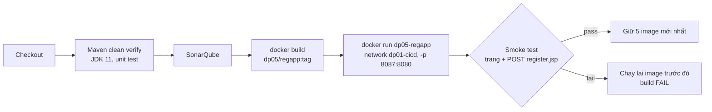
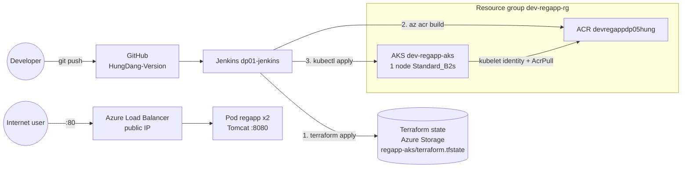
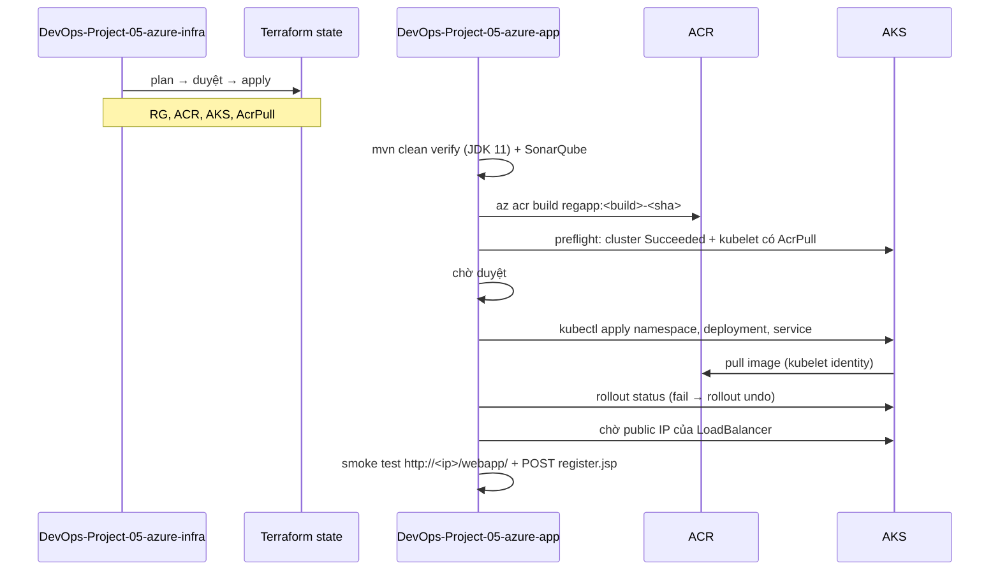

# Deploy your code on a Docker Container using Jenkins on AWS


**In this blog, we are going to deploy a Java Web app on a Docker Container built on an EC2 Instance through the use of Jenkins.**

---

## Tổng quan các cách triển khai

Ngoài tutorial AWS gốc (Phần 1, giữ nguyên nội dung), project có thêm hai cách triển khai tự động hoàn toàn bằng Jenkins pipeline. Cả ba dùng chung mã nguồn app trong `hello-world/`, nhưng mỗi cách có file triển khai riêng nên chạy song song được và không ảnh hưởng nhau.

| | Phần 1 — AWS (tutorial gốc) | Phần 2 — Local | Phần 3 — Azure |
|---|---|---|---|
| Jenkins | EC2, cài tay | Container `dp01-jenkins` (bộ CI/CD của DevOps-Project-01) | Container `dp01-jenkins` |
| Pipeline | Freestyle job cấu hình trên UI | `Jenkinsfile.local` | `azure/Jenkinsfile.infra` → `azure/Jenkinsfile.app` |
| Hạ tầng | Tạo tay trên AWS console | Docker daemon của máy local | Terraform (`azure/terraform`): ACR + AKS |
| Đưa artifact tới nơi chạy | Publish Over SSH → `/opt/docker` trên Docker host | Docker socket mount vào Jenkins | `az acr build` → Azure Container Registry |
| Chạy app | `docker run` trên EC2 Docker host | Container `dp05-regapp` | AKS Deployment 2 replica + Service LoadBalancer |
| Kiểm tra sau deploy | Mở trình duyệt | Smoke test tự động (trang + gửi form), tự rollback | Smoke test tự động, `kubectl rollout undo` khi rollout fail |
| URL | `http://<ec2-ip>:8087/webapp/` | `http://localhost:8087/webapp/` | `http://<load-balancer-ip>/webapp/` |
| Dockerfile / manifest | `hello-world/Dockerfile`, `hello-world/regapp-*.yml` | `docker/Dockerfile` | `docker/Dockerfile`, `azure/k8s/*.yaml` |

### Cấu trúc thư mục

```text
DevOps-Project-05/
├── README.md                       # File này
├── hello-world/                    # App dùng chung (Maven multi-module)
│   ├── server/                     # Greeter.java + unit test
│   ├── webapp/                     # index.jsp (form) + register.jsp (xử lý form) -> webapp.war
│   ├── Dockerfile                  # Phần 1 (AWS tutorial), không đổi
│   └── regapp-deploy.yml, regapp-service.yml   # Manifest gốc của tutorial, không đổi
├── docker/Dockerfile               # Image dùng chung cho Phần 2 và Phần 3
├── .dockerignore                   # Build context chỉ gồm Dockerfile + WAR
├── Jenkinsfile.local               # Phần 2
└── azure/                          # Phần 3
    ├── terraform/                  # RG + ACR + AKS + gán AcrPull
    ├── k8s/                        # namespace, deployment, service cho AKS
    ├── Jenkinsfile.infra           # Terraform: plan -> duyệt -> apply/destroy
    └── Jenkinsfile.app             # Maven -> Sonar -> az acr build -> duyệt -> kubectl rollout -> smoke test
```

### Thay đổi áp dụng cho mọi phần

Các lỗi dưới đây có sẵn trong mã nguồn tutorial. Bản sửa nằm trong `hello-world/webapp`, nên WAR build ra ở cả ba phần đều có bản sửa.

| Vấn đề trong tutorial gốc | Cách xử lý |
|---|---|
| Form gửi tới `action_page.php`, file không tồn tại → bấm Register luôn báo **HTTP 404** | Thêm `register.jsp` xử lý form phía server; `index.jsp` trỏ `action` vào đó |
| Form dùng GET → mật khẩu hiện trên URL, lưu vào lịch sử trình duyệt và access log | Chuyển sang `method="post"` |
| Không kiểm tra dữ liệu | `register.jsp` kiểm tra tên, email, số điện thoại (8–15 chữ số), mật khẩu ≥ 8 ký tự và hai mật khẩu khớp nhau; sai thì trả **HTTP 400** kèm danh sách lỗi |
| Dữ liệu người dùng in lại ra trang | Được escape HTML (chống XSS); mật khẩu không bao giờ được in ra |

> `register.jsp` chỉ xác nhận đăng ký, **không lưu** vào đâu vì app không có database.

Phần 2 và 3 dùng `docker/Dockerfile` thay cho `hello-world/Dockerfile`:

| `hello-world/Dockerfile` (Phần 1) | `docker/Dockerfile` (Phần 2, 3) |
|---|---|
| `tomcat:latest`: mỗi lần build có thể ra Tomcat khác, và từ Tomcat 10 trở đi đã chuyển sang `jakarta.*` trong khi app viết cho `javax.servlet` | Ghim `tomcat:9.0.122-jre21-temurin-noble` |
| Copy `webapps.dist` (manager, host-manager, examples) vào `webapps` | Không copy: container chỉ phục vụ WAR của app |
| Chạy bằng root | User non-root UID `10001` |
| `COPY ./*.war`: WAR phải được copy ra thư mục Dockerfile trước | Copy đúng `hello-world/webapp/target/webapp.war`, build context `DevOps-Project-05/` |

---

# Phần 1 — AWS: Jenkins + Docker host trên EC2 (tutorial gốc)

> Nội dung phần này giữ nguyên theo tutorial gốc.

### Agenda

* Setup Jenkins
* Setup & Configure Maven and Git
* Integrating GitHub and Maven with Jenkins
* Setup Docker Host
* Integrate Docker with Jenkins
* Automate the Build and Deploy process using Jenkins
* Test the deployment

### Prerequisites

* AWS Account
* Git/ Github Account with the Source Code
* A local machine with CLI Access
* Familiarity with Docker and Git

## Step 1: Setup Jenkins Server on AWS EC2 Instance

* Setup a Linux EC2 Instance
* Install Java
* Install Jenkins
* Start Jenkins
* Access Web UI on port 8080

_*Log in to the Amazon management console, open EC2 Dashboard, click on the Launch Instance drop-down list, and click on Launch Instance as shown below:*_


_*Once the Launch an instance window opens, provide the name of your EC2 Instance:*_


_Choose an Instance Type. Here you can select the type of machine, number of vCPUs, and memory that you want to have. Select t2.micro which is free-tier eligible._


_For this demo, we will select an already existing key pair. You can create new key pair if you don’t have:_


_Now under Network Settings, Choose the default VPC with Auto-assign public IP in enable mode. Create a new Security Group, provide a name for your security group, allow ssh traffic, and custom default TCP port of 8080 which is used by Jenkins._


_Rest of the settings we will keep them at default and go ahead and click on Launch Instance_


_On the next screen you can see a success message after the successful creation of the EC2 instance, click on Connect to instance button:_


_Now connect to instance wizard will open, go to SSH client tab and copy the provided chmod and SSH command:_


_Open any SSH Client in your local machine, take the public IP of your EC2 Instance, and add the pem key and you will be able to access your EC2 machine in my case I am using MobaXterm on Windows:_


_After logging in to our EC2 machine we will install Jenkins following the instructions from the official Jenkins website:_
<https://pkg.jenkins.io/redhat-stable/>

### To use this repository, run the following command

```
sudo wget -O /etc/yum.repos.d/jenkins.repo https://pkg.jenkins.io/redhat-stable/jenkins.repo
```

```
sudo rpm --import https://pkg.jenkins.io/redhat-stable/jenkins.io-2023.key
```

**Output:**


_Now let’s install epel packages for Amazon Linux AMI:_


_After installing epel packages, let’s install java-openjdk11:_


_Let’s check the version of Java now:_


_Now let’s install Jenkins with the below command as shown in the output:_


_After successful installation Let’s enable and start Jenkins service in our EC2 Instance:_


_Now let’s try to access the Jenkins server through our browser. For that take the public IP of your EC2 instance and paste it into your favorite browser and should see something like this:_


_To unlock Jenkins we need to go to the path /var/lib/jenkins/secrets/initialAdminPassword and fetch the admin password to proceed further:_


_Now on the Customize Jenkins page, we can go ahead and install the suggested plugins:_


_Now we can create our first Admin user, provide all the required data and proceed to save and continue._


_Now we are ready to use our Jenkins Server._


## Step 2: Integrate GitHub with Jenkins

* Install Git on Jenkins Instance
* Install Github Plugin on Jenkins GUI
* Configure Git on Jenkins GUI

_Let’s first install Git on our EC2 instance with the below command:_


_We can check the version as shown in the below screenshot:_


_To install the GitHub plugin lets go to our Jenkins Dashboard and click on manage Jenkins as shown:_


_On the next page, click on manage plugins:_


_Now in order to install any plugin we need to select Available Plugins, search for Github Integration, select the plugin, and finally click on `Install without restart` as shown below:_


_Now let’s configure Git on Jenkins. Go to Manage Jenkins, and click on Global Tool Configuration._


_Under `Git installations`, provide the name Git, and under `Path`, we can either provide the complete path where our Git is installed on the Jenkins machine or just put any name, in my case I put Git to allow Jenkins to automatically search for Git. Then click on Save to complete the installation._


## Step 3: Integrate Maven with Jenkins

* Setup Maven on Jenkins Server
* Setup Environment Variables
JAVA_HOME,M2,M2_HOME
* Install Maven Plugin
* Configure Maven and Java

_To install Maven on our Jenkins Server we will switch to the /opt directory and download the Maven package:_


_Now we will extract the tar.gz file:_


_Now we will set up Environment Variables for our root user in bash_profile in order to access Maven from any location in our Server Go to the home directory of your Jenkins server and edit the bash_profile file as shown in the below steps:_


_In the .bash_profile file, we need to add Maven and Java paths and load these values._


_To verify follow the below steps:_


_With this setup, we can execute maven commands from anywhere on the server:_


_Now we need to update the paths where Java and Maven have been installed in the Jenkins UI. We will first install the Maven Integration Plugin as shown below:_


_After clicking on Install without restart, go again to manage Jenkins and select Global Tool configuration to set the paths for Java and Maven._

**For JAVA:**


**For MAVEN:**


_Click on save and hence we have successfully Integrated Java and Maven with Jenkins._

## Step 4: Setup a Docker Host

* Setup a Linux EC2 Instance
* Install Docker
* Start Docker Services
* Run Basic Docker Commands

_Let's first launch an EC2 Instance. We will skip the steps here as we have already shown earlier how to create an EC2 Instance._

_Below is the screenshot of our newly created EC2 Instance on which we will install Docker:_


_We will first install Docker on this EC2 Instance:_


_After the successful installation of Docker, let’s verify the version of Docker:_


_Also, let’s enable and start the Docker Service:_


### Create Tomcat Docker Container

_In my previous blog, I deployed a Java code on a Tomcat VM, here in this blog we will deploy on a Tomcat Docker container._

_We will first pull the official Tomcat docker image from the Docker Hub and then run the container out of the same image._


Let’s now create a Container from the same Image with the command:

```
docker run -d --name tomcat-container -p 8081:8080 tomcat
```


_The above command runs a docker container in detached mode with the name tomcat-container and we are exposing port 8081 of our host machine with port 8080 of our container and it's using the latest image of tomcat._

Let's verify the running container on our EC2 machine:


_Before accessing our container from the browser we need to allow port 8081 in the Security Group of our EC2 docker-host machine._

Go to the Security group of your EC2 machine and click on Edit inbound rules:


_Click on Add rule, select Custom TCP as type, and in port range put 8081–9000 in case we need it in the future, and under source select from anywhere and then click on Save rules to proceed:_


Now let’s take the public IP of our Docker-host EC2 machine and with port 8081 access it from our browser:


_From the above screenshot, you can see that although there is a 404 error, it also displays Apache Tomcat at the bottom which means the installation is successful however this is a known issue with the Tomcat docker image that we will fix in the next steps._

_The above issue occurs because whenever we try to access the Tomcat server from the browser it will look for the files in /webapps directory which is empty and the actual files are being stored in /webapps.dist._

_So in order to fix this issue we will copy all the content from webapps.dist to webapps directory and that will resolve the issue._

Let's access our tomcat container and perform the steps as shown below:


Once we are in the tomcat container go to the /webapps.dist directory and copy all the content to webapps directory:


After that we should be able to access our tomcat docker container:


_Somehow if we stop this container and start another container with the same Image on a different port we will face the same issue of 404 error.
This happens because every time we launch a new container we are using a new Image as the previous container gets deleted._

_This issue can be solved by creating our own Docker Image with the appropriate changes required to run our container. This can be achieved by creating a Dockerfile on which we can mention the steps required to build the docker image and from that Image, we can run the container._

**Create a Customized Dockerfile for Tomcat:**

_To create the Dockerfile we will use the official Image of Tomcat and with it will mention the step to copy the contents from the directory /webapps.dist to /webapps:_

```
FROM  tomcat:latest
RUN cp -R /usr/local/tomcat/webapps.dist/* /usr/local/tomcat/webapps
```


Now let's build the Docker Image using this Dockerfile using the below command:

```
docker build -t tomcatserver .
```


Let’s verify with the docker images command:


Now is the time to run the docker container out of our customized docker image which we built using our dockerfile. The command is as:

```
docker run -d --name tomcat-server -p 8085:8080 tomcatserver
```

_Here you should remember that we have already allowed port range 8081–9000 in the security group of our docker EC2 Instance._


Let’s verify using the docker ps command:


Also, let's try to access the Tomcat server on port 8085 from the browser:


_Hence we should be now able to launch as many times the same container without facing any issues by utilizing our customizable Dockerfile._

### Step 5: Integrate Docker with Jenkins

* Create a dockeradmin user
* Install the “Publish Over SSH” plugin
* Add Dockerhost to Jenkins “configure systems”

_Let's first create a dockeradmin user and create a password for it as well._


Now let’s add this user to the Docker group with the below command:

```
usermod -aG docker dockeradmin
```

_Now in order to access the server using the newly created User we need to allow password-based authentication. For that, we need to do some changes in the /etc/ssh/sshd_config file._


_As you can see above we need to uncomment PasswordAuthentication yes and comment out PasswordAuthentication no._

Once we have updated the config file we need to restart the services with the command:

```
service sshd reload
Redirecting to /bin/systemctl reload sshd.service
```

_Now we would be able to log in using the dockeradmin user credentials:_


Now next step is to integrate Docker with Jenkins, for that we need to install the “Publish Over SSH” plugin:

Go to Manage Jenkins > Manage Plugins > Available plugins and search for publish over ssh plugin:


Click on Install without restart to install the plugin.

Now we need to configure our dockerhost in Jenkins. For that go to Manage Jenkins > Configure System:


On the next page after scrolling down you would be able to see Publish over SSH section where you need to add a new SSH server with the info as shown below:


_It should be noted that it's best practice to use ssh keys however for this demo we are using password-based authentication. In the above screenshot, we have provided details of our Docker host which we created on EC2 Instance. Also, note the use of private IP under Hostname as both our Jenkins Server and Dockerhost are on the same subnet. We can also use Public IP here._

_Click on Apply and Save to proceed. With this, our Docker integration with Jenkins is successfully accomplished._

### Step 6: Create Jenkins Job to Build and Copy Artifacts on to Docker Host

_In this section, we would create a new job in Jenkins however we would copy from the existing job_


_Click on Ok to configure the job._

_On the configure settings you will notice that our new job has inherited all the settings from our previous build job. However, you can change the description and other settings:_


Now one important change we need to do is to delete the previous job post-build step and select Send files or execute commands over SSH option.

_Under the SSH server, it will display the already created ssh server which we created in our earlier steps. Then we need to provide the path from where the WAR file will be copied and then deployed on the remote server for which we also need to provide a path under the Remote directory. Then finally Apply and Save to proceed._


_Once we save the project the build will be triggered automatically due to Poll by SCM feature which we have enabled._

Now if we check the console output of our job we should see the Job has been successfully finished.


We can also verify by checking the presence webapp.war file on our docker EC2 machine:


## Step 7: Update Dockerfile to copy Artifacts to launch New Container

_In this step, we will create a Dockerfile to include the webapp.war file to launch a new container using our Java web Application. For that, we need to copy our artifacts to the location where we have our Dockerfile._

We will create a separate directory named docker under the root user of our dockerhost inside /opt.


_As you can in the above screenshot that this new docker directory is owned by root and in Jenkins configuration settings we have mentioned that the artifacts are owned by the dockeradmin user. So let’s give the ownership of this directory to dockeradmin user._


_Now let's copy the Dockerfile which we created in earlier steps to this newly created docker directory and change its ownership to dockeradmin as well:_

```
mv Dockerfile /opt/docker/
cd /opt/docker/
chown -R dockeradmin:dockeradmin /opt/docker/

ll
total 4
-rw-r--r-- 1 dockeradmin dockeradmin 89 May 10 12:08 Dockerfile
```

Now we need to configure our Jenkins job to change the remote directory from /home/dockeradmin to //opt//docker:


Click on Apply and Save to build the Job manually.

If the build is successful we can see the webapp.war file in the /opt/docker directory of our dockerhost:


_Now in our Dockerfile, we need to mention the location of this WAR file and copy this file onto the /usr/local/tomcat/webapps location in the container._

**Dockerfile:**

```
FROM  tomcat:latest
RUN cp -R /usr/local/tomcat/webapps.dist/* /usr/local/tomcat/webapps
COPY ./*.war /usr/local/tomcat/webapps
```

_Let’s now build a new image using this updated Dockerfile with the command:_

```
docker build -t tomcat:v1 .
```

**Output:**


In the next step let’s now create a container out of this image with the command:

```
docker run -d --name tomcatv1 -p 8086:8080 tomcat:v1
```

**Output:**


Now let’s access this application from our browser using URL <http://54.173.227.226:8086/webapp/>


_So far we have successfully copied the artifacts to our dockerhost and then manually used docker commands like docker build and docker run to deploy our application on the docker container._

## Step 8: Automate Build and Deployment on Docker Container

_In this step, we will try to automate end to end Jenkins pipeline right from when we commit our code to GitHub, it should build it, create an artifact and then copy the artifacts to the docker host, create a docker image, and finally create a docker container to deploy the project._

_For this automation to happen we need to go to our Jenkins job, select configure, and under Send files or execute commands over SSH there is Exec command field where we need to put some commands as shown below:_

```
cd /opt/docker;
docker build -t regapp:v1 .;
docker run -d --name registerapp -p 8087:8080 regapp:v1
```


_Now let’s do some minor changes in our code and commit the changes which will trigger the Jenkins build process and we can see the results of automation._

_As soon as I made some changes in the Readme file in the GitHub repository the build got triggered in our Jenkins Job._

If the build is successful we should see our new docker image and docker container as shown in the below screenshot:


Also, we if access our new dockerized app from our browser on port 8087, the result should be something like this:


### Conclusion

**In this blog, we learned how to automate the build and deploy process using GitHub, Jenkins, Docker, and AWS EC2.**

**Happy Learning!**

---

# Phần 2 — Local: Jenkins pipeline deploy container trên máy local

Tự động hóa Step 6–8 của Phần 1 ngay trên máy local. Jenkins chạy trong container và điều khiển Docker daemon của host qua `/var/run/docker.sock`. Vì vậy không cần Docker host riêng, không cần user `dockeradmin` và không cần plugin Publish Over SSH.

## Tiền điều kiện

Dùng lại bộ CI/CD của DevOps-Project-01 (`DevOps-Project-01/cicd`):

```bash
docker network create dp01-cicd                      # một lần
cd DevOps-Project-01/cicd/jenkins   && docker compose up -d --build   # http://localhost:8080
cd ../sonarqube                     && docker compose up -d           # http://localhost:9000
```

Image `dp01/jenkins` đã có sẵn JDK 11 (`/opt/java/jdk-11`), Maven, Docker CLI, Terraform và Azure CLI. App này biên dịch ra bytecode Java 1.7: JDK 11 vẫn build được, JDK 21 thì không, nên pipeline build bằng JDK 11.

| Credential | Loại | Dùng khi |
|---|---|---|
| `sonarqube-token` | Secret text | `RUN_SONAR=true` (SonarQube → My Account → Security → Generate Token) |

## Tạo job

| Job | Definition | Repository / Branch | Script Path |
|---|---|---|---|
| `DevOps-Project-05-local` | Pipeline script from SCM | repo này / `*/HungDang-Version` | `DevOps-Project-05/Jenkinsfile.local` |

Jenkins đọc Jenkinsfile từ Git, nên mọi thay đổi phải được **push** lên nhánh trên thì job mới thấy.

| Tham số | Mặc định | Ý nghĩa |
|---|---|---|
| `RUN_SONAR` | `true` | Phân tích SonarQube, project key `devops-project-05` |
| `HOST_PORT` | `8087` | Port trên host (8080 đã bị Jenkins dùng) |
| `IMAGE_TAG` | *(rỗng)* | Rỗng = `<BUILD_NUMBER>-<git sha ngắn>` |

## Luồng chạy



1. **Build & Test:** `mvn -B clean verify`. Kết quả JUnit và `webapp.war` được lưu vào build.
2. **Build Image:** `docker build -f docker/Dockerfile`. `.dockerignore` giới hạn build context chỉ còn Dockerfile + WAR.
3. **Deploy:** ghi lại image đang chạy, xoá container `dp05-regapp` cũ rồi chạy container mới với `--restart unless-stopped` và `--memory 512m`.
4. **Smoke Test:** Jenkins gọi container theo tên trên network `dp01-cicd`. Test kiểm tra trang form, rồi gửi thử một đăng ký và chờ trang "Registration successful". Nếu fail, pipeline tự chạy lại image trước đó rồi đánh fail build.
5. **Prune:** giữ 5 tag `dp05/regapp` mới nhất.

## Kiểm tra và vận hành

```bash
curl -s http://localhost:8087/webapp/ | grep "New user Register"
curl -s -d Name=Test -d mobile=0912345678 -d email=t@example.com \
     -d psw=abcdefgh1 -d psw-repeat=abcdefgh1 \
     http://localhost:8087/webapp/register.jsp | grep "<h1>"      # Registration successful

docker ps --filter name=dp05-regapp
docker logs -f dp05-regapp
docker images dp05/regapp                                        # các bản còn giữ để rollback
```

Rollback tay về một bản cũ:

```bash
docker rm -f dp05-regapp
docker run -d --name dp05-regapp --restart unless-stopped --network dp01-cicd \
  -p 8087:8080 --memory 512m dp05/regapp:<tag-cũ>
```

Dọn dẹp: `docker rm -f dp05-regapp && docker images dp05/regapp -q | xargs -r docker rmi`

> Pipeline mount Docker socket vào Jenkins, nghĩa là Jenkins có quyền tương đương root trên host. Cách này chấp nhận được khi học local, không dùng cho môi trường dùng chung.

---

# Phần 3 — Azure: Terraform + Jenkins triển khai lên AKS

Bản Azure của Phần 1. Giữ nguyên ý tưởng (Jenkins build WAR → đóng image Tomcat → chạy container), nhưng thay Docker host EC2 bằng **Azure Kubernetes Service**, vì project đã có sẵn manifest Kubernetes (`regapp-deploy.yml`, `regapp-service.yml`). Toàn bộ hạ tầng được tạo bằng Terraform qua pipeline, không tạo tay trên Portal.

## Kiến trúc



### Ánh xạ AWS (Phần 1) → Azure

| Phần 1 — AWS | Phần 3 — Azure |
|---|---|
| Tạo EC2 Docker host bằng tay | Terraform tạo AKS (`azure/terraform/main.tf`) |
| Jenkins trên EC2 | Jenkins container `dp01-jenkins` (dùng lại của DevOps-Project-01) |
| Freestyle job + Poll SCM | Pipeline as code: `Jenkinsfile.infra`, `Jenkinsfile.app` |
| Publish Over SSH copy WAR sang `/opt/docker` | `az acr build`: ACR build image từ Dockerfile + WAR, Jenkins không cần Docker daemon hay mật khẩu registry |
| `docker build` / `docker run` trên Docker host | `kubectl apply` Deployment 2 replica, rolling update |
| Image `valaxy/regapp` trên Docker Hub (trong `regapp-deploy.yml`) | Registry riêng ACR, tag `<build>-<sha>`, cấm `latest` |
| User `dockeradmin` + SSH bằng mật khẩu | Không SSH: service principal + kubeconfig tạm trong workspace |
| Security group mở 8081–9000 | Service `LoadBalancer` port 80 → 8080 |
| Không có health check | startup / readiness / liveness probe trên `/webapp/` |

### Khác biệt so với manifest gốc

| `hello-world/regapp-*.yml` | `azure/k8s/*.yaml` |
|---|---|
| Namespace `default` | Namespace riêng `regapp` |
| `image: valaxy/regapp` (latest) | `__IMAGE__`, pipeline thay bằng `<acr>.azurecr.io/regapp:<tag>` |
| `maxUnavailable: 1` | `maxUnavailable: 0`, không giảm capacity khi rollout |
| Không có resource / probe | requests 100m CPU / 256Mi, limit 512Mi; startup/readiness/liveness probe |
| Chạy root | `runAsNonRoot`, UID 10001, drop mọi capability, seccomp `RuntimeDefault` |
| Service `8080:8080` | Service `80 → 8080`, tuỳ chọn `loadBalancerSourceRanges` |

## Tiền điều kiện

1. Jenkins + SonarQube của Phần 2 đang chạy.
2. Azure subscription đã đăng ký provider `Microsoft.ContainerService`: `az provider register --namespace Microsoft.ContainerService`.
3. Storage account chứa Terraform state (dùng chung với DevOps-Project-01/04): resource group `tfstate-rg`, container `tfstate`.
4. Service principal cho Jenkins có quyền như mục [Quyền cho service principal](#quyền-cho-service-principal).
5. Credentials trong Jenkins (Manage Jenkins → Credentials → System → Global):

| ID | Loại | Nội dung |
|---|---|---|
| `azure-sp` | Username with password | appId / client secret của service principal |
| `azure-tenant` | Secret text | Tenant ID |
| `azure-subscription` | Secret text | Subscription ID |
| `sonarqube-token` | Secret text | Token SonarQube (khi `RUN_SONAR=true`) |

`kubectl` không có trong image Jenkins. Pipeline app tự tải bản khớp với phiên bản của cluster, kiểm tra SHA-256, rồi cache ở `$JENKINS_HOME/tools/kubectl/`.

## Tài nguyên được tạo

Tên được sinh theo quy ước, nên pipeline app suy ra được tên resource mà không cần đọc Terraform state:

| Resource | Tên (mặc định `ENVIRONMENT=dev`, `NAME_SUFFIX=dp05hung`) | Ghi chú |
|---|---|---|
| Resource group | `dev-regapp-rg` | |
| Container Registry | `devregappdp05hung` (`<env>regapp<suffix>`) | Basic, admin user tắt. Tên phải duy nhất toàn cầu |
| AKS | `dev-regapp-aks` | Free tier, 1 node `Standard_B2s`, Azure CNI Overlay, K8s theo mặc định của region |
| Node resource group | `dev-regapp-aks-nodes-rg` | AKS tự quản: VMSS, Load Balancer, public IP, kubelet identity |
| Role assignment | AcrPull cho kubelet identity trên ACR | `azurerm_role_assignment.aks_acr_pull` |

**Terraform state** lưu trên Azure Storage, không nằm trong Jenkins:

| | |
|---|---|
| Storage account | `hddevopsprojectstg001` (tham số `TFSTATE_STORAGE_ACCOUNT`) |
| Resource group / container | `tfstate-rg` / `tfstate` |
| Key | `regapp-aks/terraform.tfstate` (Project-01 dùng `java-app/…`, Project-04 dùng `django-app/…`) |

Trong lúc Terraform chạy, blob state bị khoá bằng lease, nên hai build không ghi state cùng lúc được.

## Quyền cho service principal

| Quyền | Để làm gì |
|---|---|
| **Contributor** (subscription hoặc RG đích) | Tạo RG, ACR, AKS; chạy `az acr build`; `az aks get-credentials` |
| **Role Based Access Control Administrator** có điều kiện chỉ cho gán **AcrPull** | Terraform gán AcrPull cho kubelet identity của AKS |
| Đọc key của storage account state (`listKeys`, đã có trong Contributor) | Backend `azurerm` đọc và ghi state bằng access key |

AcrPull được gán trong `azure/terraform/main.tf`:

```hcl
resource "azurerm_role_assignment" "aks_acr_pull" {
  count                = var.manage_acr_pull_assignment ? 1 : 0
  scope                = azurerm_container_registry.main.id                           # chỉ registry này
  role_definition_name = "AcrPull"
  principal_id         = azurerm_kubernetes_cluster.main.kubelet_identity[0].object_id
}
```

Người thực hiện gán là SP của credential `azure-sp`, trong lúc `terraform apply`. Người nhận là kubelet identity `dev-regapp-aks-agentpool`: identity mà node dùng để pull image. Identity này khác với identity `SystemAssigned` của control plane.

Contributor **không có** `Microsoft.Authorization/roleAssignments/write`. Thiếu role RBAC Administrator thì apply sẽ dừng ở `403 AuthorizationFailed`. Cấp role này một lần bằng account Owner:

1. Subscription → **Access control (IAM)** → Add role assignment → **Role Based Access Control Administrator**.
2. Members: SP của credential `azure-sp`.
3. Tab **Conditions** → *Constrain roles and principal types* → chỉ chọn role **AcrPull**, principal type **Service principals**.

> Không nên chọn tuỳ chọn *Allow user to assign all roles except privileged administrative roles*. Với tuỳ chọn đó, SP gán được hầu như mọi role (Contributor, Key Vault Administrator, …) cho bất kỳ ai. Pipeline này chỉ cần AcrPull.

**Không thể cấp RBAC Administrator?** Chạy infra với `MANAGE_ACR_PULL_ASSIGNMENT=false`, rồi dùng account Owner hoặc User Access Administrator chạy lệnh trong output `acr_pull_grant_command`. Mỗi lần AKS bị tạo lại (destroy/apply), kubelet identity sẽ đổi và phải gán lại quyền.

## Tạo job

| Job | Script Path | Branch |
|---|---|---|
| `DevOps-Project-05-azure-infra` | `DevOps-Project-05/azure/Jenkinsfile.infra` | `*/HungDang-Version` |
| `DevOps-Project-05-azure-app` | `DevOps-Project-05/azure/Jenkinsfile.app` | `*/HungDang-Version` |

Cả hai là *Pipeline script from SCM*, trỏ vào repo này.

### Tham số

`Jenkinsfile.infra`:

| Tham số | Mặc định | Ý nghĩa |
|---|---|---|
| `TF_ACTION` | `plan-only` | `plan-only` / `apply` / `destroy`. `apply` và `destroy` dừng chờ duyệt sau khi plan |
| `ENVIRONMENT` | `dev` | Tiền tố tên resource. **Phải khớp với job app** |
| `LOCATION` | `southeastasia` | Region |
| `NAME_SUFFIX` | `dp05hung` | Hậu tố cho tên ACR (duy nhất toàn cầu). **Phải khớp với job app** |
| `NODE_VM_SIZE` | `Standard_B2s` | Tối thiểu 2 vCPU / 4 GiB. Đổi sang `Standard_D2as_v5` nếu region hạn chế B-series |
| `NODE_COUNT` | `1` | 1–5 node |
| `MANAGE_ACR_PULL_ASSIGNMENT` | `true` | Terraform tự gán AcrPull, xem mục quyền |
| `TFSTATE_STORAGE_ACCOUNT` | `hddevopsprojectstg001` | Storage account chứa state |

`Jenkinsfile.app`:

| Tham số | Mặc định | Ý nghĩa |
|---|---|---|
| `RUN_SONAR` | `true` | Phân tích SonarQube |
| `DEPLOY` | `true` | `false` = chỉ build và đẩy image lên ACR, không deploy |
| `ENVIRONMENT`, `NAME_SUFFIX` | `dev`, `dp05hung` | Phải khớp với job infra, dùng để suy ra tên ACR, RG và AKS |
| `IMAGE_TAG` | *(rỗng)* | Rỗng = `<BUILD_NUMBER>-<git sha ngắn>`. `latest` bị từ chối |

## Quy trình triển khai



### Bước 1: Tạo hạ tầng

1. Chạy `DevOps-Project-05-azure-infra` với `TF_ACTION=plan-only` để xem plan mà không thay đổi gì. Lần đầu plan phải ra `Plan: 4 to add, 0 to change, 0 to destroy`.
2. Chạy lại với `TF_ACTION=apply`, đọc plan trong log, rồi bấm **Yes, apply** ở stage Approval.
3. Chờ khoảng 5–6 phút (riêng AKS khoảng 4–5 phút). Stage Output in ra `acr_login_server`, `aks_name`, `get_credentials_command`…

Mỗi lần chạy, pipeline xoá `.terraform/`, file lock và state local cũ rồi `terraform init -reconfigure`. Vì vậy workspace Jenkins không bao giờ giữ state.

### Bước 2: Build và deploy app

Chạy `DevOps-Project-05-azure-app`, giữ `DEPLOY=true`:

| Stage | Việc làm |
|---|---|
| Build & Test (Maven) | `mvn -B clean verify` bằng JDK 11, lưu kết quả JUnit và `webapp.war` |
| Code Quality (SonarQube) | Project key `devops-project-05` |
| Build Image (ACR) | `az acr build --file docker/Dockerfile`, build context chỉ gồm Dockerfile + WAR (vài KB). Báo lỗi rõ nếu ACR chưa tồn tại |
| Preflight: AKS + AcrPull | Kiểm tra cluster `Succeeded` và kubelet identity đã có AcrPull. Thiếu thì dừng, in sẵn lệnh cần chạy, thay vì để pod kẹt `ImagePullBackOff` |
| Approval to Deploy | Bấm **Yes, deploy** |
| Deploy to AKS | Tải kubectl, `az aks get-credentials` vào kubeconfig trong workspace, thay `__IMAGE__`, `kubectl apply`, ghi `change-cause`, `rollout status --timeout=5m`. Fail thì `rollout undo`. Sau đó chờ public IP của Service |
| Smoke Test | Chờ trang "New user Register", rồi gửi thử form và chờ "Registration successful" |

Cuối log có dòng `Smoke test passed (form + register): http://<ip>/webapp/`.

Lần deploy sau chỉ cần chạy lại job app. Mỗi build tạo một tag image mới và một revision mới của Deployment. Không cần chạy lại job infra.

### Bước 3: Kiểm tra

```bash
az aks get-credentials -g dev-regapp-rg -n dev-regapp-aks
kubectl -n regapp get deploy,rs,pods,svc -o wide
kubectl -n regapp rollout history deployment/regapp
kubectl -n regapp logs deploy/regapp --tail 100

IP=$(kubectl -n regapp get svc regapp -o jsonpath='{.status.loadBalancer.ingress[0].ip}')
curl -s "http://$IP/webapp/" | grep "New user Register"
az acr repository show-tags -n devregappdp05hung --repository regapp -o table
```

### Rollback

```bash
kubectl -n regapp rollout history deployment/regapp        # CHANGE-CAUSE ghi job và image của từng revision
kubectl -n regapp rollout undo deployment/regapp            # về revision ngay trước
kubectl -n regapp rollout undo deployment/regapp --to-revision=<n>
```

Deployment giữ 5 revision (`revisionHistoryLimit: 5`). Nếu rollout của một build bị fail, pipeline tự `rollout undo`.

> Không rollback bằng cách chạy lại job với `IMAGE_TAG` của bản cũ: job sẽ build lại **code hiện tại** và ghi đè tag đó. Muốn deploy lại một commit cũ thì chạy job trên commit đó.

Lần deploy sau, pipeline sẽ `kubectl apply` lại manifest và ghi đè bản rollback tay. Hãy sửa code và push để bản mới trở thành bản đúng.

### Bước 4: Dọn dẹp

Chạy `DevOps-Project-05-azure-infra` với `TF_ACTION=destroy` rồi duyệt. Terraform xoá toàn bộ 4 resource, gồm cả node resource group, Load Balancer và public IP do AKS tạo. Blob state vẫn còn nhưng rỗng.

Node AKS và public IP tính tiền theo giờ kể cả khi không có traffic. Học xong nên destroy ngay.

## Đã kiểm chứng

Chạy end-to-end ngày 30/09/2026 trên subscription thật:

| Bước | Kết quả |
|---|---|
| infra `apply` | 4 resource được tạo: RG 11s, ACR 34s, AKS 4m40s, AcrPull 25s |
| app deploy | Image `devregappdp05hung.azurecr.io/regapp:1-860fb12` được build trong 32s. Preflight báo `AcrPull present`. Rollout OK trên node K8s v1.35.7. Smoke test pass (trang + form) |
| infra `destroy` | Resource group `dev-regapp-rg` đã bị xoá |

## Sự cố thường gặp

| Triệu chứng | Nguyên nhân | Xử lý |
|---|---|---|
| `403 AuthorizationFailed` ở `azurerm_role_assignment.aks_acr_pull` | SP chỉ có Contributor | Cấp RBAC Administrator có điều kiện AcrPull, hoặc dùng `MANAGE_ACR_PULL_ASSIGNMENT=false` + gán tay |
| Preflight báo thiếu AcrPull / pod `ImagePullBackOff` | Chưa gán AcrPull, RBAC chưa propagate, hoặc AKS vừa tạo lại (kubelet identity mới) | Chạy lại infra `apply`, chờ 2–5 phút rồi chạy lại job app |
| `registry ... not found` / `AKS cluster ... is 'missing'` | Chưa chạy infra, hoặc `ENVIRONMENT`/`NAME_SUFFIX` lệch giữa hai job | Chạy infra `apply` với cùng tham số |
| ACR báo tên đã tồn tại | Tên ACR phải duy nhất toàn cầu | Đổi `NAME_SUFFIX` ở **cả hai** job |
| `SkuNotAvailable` / hết quota khi tạo AKS | Region hạn chế VM size | `NODE_VM_SIZE=Standard_D2as_v5` |
| `Error acquiring the state lock` | Một build khác đang chạy, hoặc build trước bị abort giữa chừng | Chờ build kia xong. Nếu lock bị kẹt thì `terraform force-unlock <LOCK_ID>` (ID nằm trong thông báo lỗi) |
| Service không có external IP sau 5 phút | Hết quota public IP, hoặc Load Balancer đang lỗi | `kubectl -n regapp describe svc regapp`, xem Events |
| Rollout timeout | Probe fail hoặc pod không đủ tài nguyên | Xem `kubectl -n regapp get events --sort-by=.lastTimestamp` (pipeline cũng in ra trước khi undo) |

## Bảo mật

- Service `LoadBalancer` **mở ra internet và không có xác thực**, giống manifest gốc. Muốn giới hạn IP thì bỏ comment `loadBalancerSourceRanges` trong `azure/k8s/service.yaml`. Dùng thật thì nên đặt Ingress/Application Gateway + WAF và TLS phía trước.
- Pull image bằng kubelet managed identity + AcrPull chỉ trên registry này. ACR tắt admin user, không có mật khẩu registry ở đâu cả.
- AKS để API server public và bật local account để pipeline dùng `az aks get-credentials` mà không cần kubelogin. Production nên bật Entra ID + Azure RBAC cho Kubernetes, tắt local account và giới hạn `api_server_authorized_ip_ranges`.
- Kubeconfig và profile Azure CLI của mỗi build nằm trong workspace, bị `cleanWs()` xoá khi build kết thúc. Secret chỉ đi qua `withCredentials`.
- Pod chạy non-root, không có service account token, drop mọi capability.
- Đổi mật khẩu admin mặc định của Jenkins (`admin123`) và thu hồi API token không dùng nữa.

## Chạy Terraform tay (không qua Jenkins)

```bash
cd DevOps-Project-05/azure/terraform
cp terraform.tfvars.example terraform.tfvars
terraform init -backend-config="storage_account_name=hddevopsprojectstg001"
terraform plan
terraform apply
terraform output
terraform destroy        # dọn dẹp
```

Phải đăng nhập bằng `az login`, hoặc export `ARM_CLIENT_ID`/`ARM_CLIENT_SECRET`/`ARM_TENANT_ID`/`ARM_SUBSCRIPTION_ID`. Chạy tay và chạy qua Jenkins dùng **chung một state**, nên đừng chạy cả hai cùng lúc.

---

## 🛠️ Author & Community  

This project is crafted by **[Harshhaa](https://github.com/NotHarshhaa)** 💡.  
I’d love to hear your feedback! Feel free to share your thoughts.  

📧 **Connect with me:**

- **GitHub**: [@NotHarshhaa](https://github.com/NotHarshhaa)  
- **Blog**: [ProDevOpsGuy](https://blog.prodevopsguytech.com)  
- **Telegram Community**: [Join Here](https://t.me/prodevopsguy)  
- **LinkedIn**: [Harshhaa Vardhan Reddy](https://www.linkedin.com/in/harshhaa-vardhan-reddy/)  

---

## ⭐ Support the Project  

If you found this helpful, consider **starring** ⭐ the repository and sharing it with your network! 🚀  

### 📢 Stay Connected  

  
