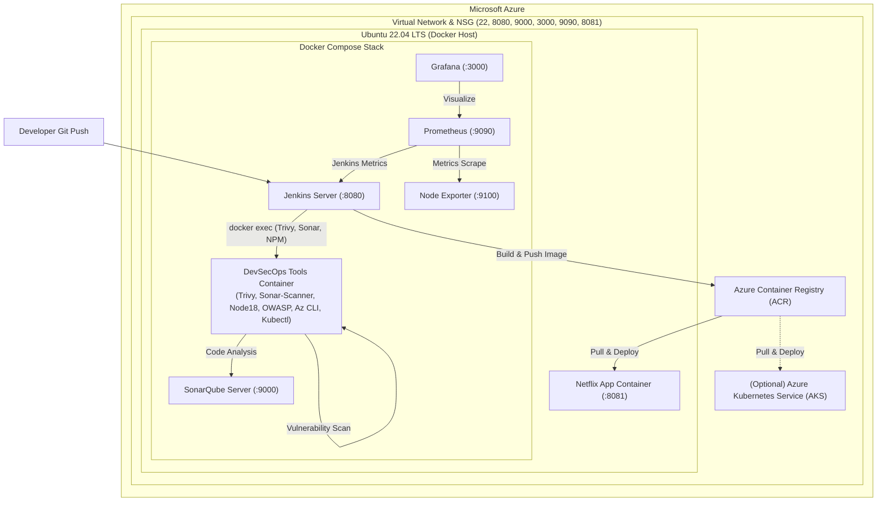

# Azure DevSecOps: Netflix Clone CI/CD với Containerized Tools & Monitoring

Phiên bản này được thiết kế tách biệt hoàn toàn dành riêng cho nền tảng **Microsoft Azure**, chuẩn hóa luồng CI/CD hiện đại: **toàn bộ công cụ DevSecOps (Trivy, Sonar-Scanner, Node.js, OWASP Dependency-Check, Docker CLI, Kubectl, Azure CLI) đều được đóng gói và chạy sẵn bên trong Docker Container**, không cần cài đặt rải rác trên máy chủ host.

---

## 1. Kiến trúc tổng thể trên Azure



---

## 2. Cấu trúc thư mục

```
/home/adminhung/DevOps-Projects/DevOps-Project-09/azure/
├── README.md                      # Tài liệu hướng dẫn chi tiết
├── terraform/                     # Hạ tầng mã nguồn (IaC) trên Azure
│   ├── main.tf                    # Resource Group, VNet, Subnet, NSG, VM, ACR, AKS
│   ├── variables.tf               # Khai báo các tham số Azure
│   ├── outputs.tf                 # Đầu ra IP, URL dịch vụ, ACR credentials
│   ├── terraform.tfvars.example   # File mẫu khai báo biến
│   └── user-data.sh               # Cloud-init tự động cài đặt Docker & cấu hình kernel
├── docker/                        # Hệ sinh thái container hoá toàn bộ công cụ
│   ├── docker-compose.yml         # Jenkins, SonarQube, Prometheus, Grafana, Tools container
│   ├── Dockerfile.devops-tools    # Container chứa sẵn Trivy, SonarScanner, Node, OWASP, Az CLI, Kubectl
│   └── prometheus/
│       └── prometheus.yml         # Cấu hình scrape metrics Prometheus
├── Jenkinsfile                    # Pipeline Jenkins DevSecOps (Build, Test, Scan, Deploy App)
├── Jenkinsfile.infra              # Pipeline Jenkins triển khai hạ tầng Azure qua Terraform
├── k8s/                           # Kubernetes manifests cho Azure AKS
│   ├── deployment.yaml            # Triển khai Pods ứng dụng từ ACR
│   └── service.yaml               # Azure LoadBalancer Service
```

---

## 3. Điểm nổi bật: Toàn bộ công cụ chạy trong Docker Container

Không giống như các mô hình truyền thống yêu cầu cài đặt Java, Node.js, Trivy, SonarScanner trực tiếp lên hệ điều hành máy chủ:

1. **`devsecops-tools` Container**:
   - Được định nghĩa tại [Dockerfile.devops-tools](file:///home/adminhung/DevOps-Projects/DevOps-Project-09/azure/docker/Dockerfile.devops-tools).
   - Chứa sẵn **Trivy (Aqua Security)**, **Sonar-Scanner CLI**, **Node.js 18**, **OWASP Dependency-Check**, **Docker CLI**, **Kubectl**, và **Azure CLI**.
   - Chạy nền liên tục dưới dạng daemon container.
2. **Luồng Pipeline an toàn & độc lập**:
   - Jenkins ra lệnh cho container `devsecops-tools` thực hiện quét mã nguồn:
     ```bash
     docker exec -i devsecops-tools trivy fs --severity HIGH,CRITICAL .
     ```
   - Quét lỗ hổng của Docker Image vừa build:
     ```bash
     docker exec -i devsecops-tools trivy image --severity HIGH,CRITICAL <image-name>
     ```
   - Chạy SonarQube Scanner và Dependency Check hoàn toàn tách lập với máy chủ.

---

## 4. Hướng dẫn triển khai từng bước

### Bước 1: Khởi tạo hạ tầng Azure bằng Terraform

Bạn có thể lựa chọn 1 trong 2 cách sau:

#### Cách 1: Chạy tự động qua Jenkins Pipeline (Khuyến nghị)
Tạo một Job mới trên Jenkins (ví dụ: `DevOps-Project-09-infra`) trỏ vào file:
[Jenkinsfile.infra](file:///home/adminhung/DevOps-Projects/DevOps-Project-09/azure/Jenkinsfile.infra)
- **Tự động liên kết credentials có sẵn trong Jenkins:**
  - `azure-sp`: Service Principal (Client ID & Client Secret)
  - `azure-tenant`: Tenant ID
  - `azure-subscription`: Subscription ID
  - `vmss-ssh-pubkey`: SSH Public Key cho Linux VM
- **Tham số Pipeline linh hoạt:**
  - `TF_ACTION`: `plan-only`, `apply`, hoặc `destroy` (có bước Approval xác nhận trước khi apply/destroy).
  - `ENVIRONMENT`, `LOCATION`, `NAME_SUFFIX`, `VM_SIZE`, `ENABLE_AKS`.

#### Cách 2: Triển khai thủ công qua CLI máy trạm
1. Đăng nhập Azure CLI trên máy tính của bạn:
   ```bash
   az login
   ```
2. Di chuyển vào thư mục Terraform:
   ```bash
   cd /home/adminhung/DevOps-Projects/DevOps-Project-09/azure/terraform
   ```
3. Tạo file cấu hình biến từ mẫu:
   ```bash
   cp terraform.tfvars.example terraform.tfvars
   ```
   *Tùy chỉnh `ssh_public_key_path` hoặc `location` (ví dụ `southeastasia`) nếu cần.*
4. Chạy Terraform để khởi tạo hạ tầng:
   ```bash
   terraform init -backend-config="storage_account_name=hddevopsprojectstg001"
   terraform plan
   terraform apply -auto-approve
   ```
5. Khi hoàn tất, ghi nhận các thông tin từ output:
   - `vm_public_ip`: Địa chỉ IP của máy chủ Azure.
   - `acr_login_server`, `acr_admin_username`, `acr_admin_password`: Thông tin đăng nhập Azure Container Registry.
   - `jenkins_url`, `sonarqube_url`, `grafana_url`, `netflix_app_url`.

---

### Bước 2: Khởi động hệ sinh thái DevSecOps Containers

1. SSH vào Azure VM:
   ```bash
   ssh azureuser@<VM_PUBLIC_IP>
   ```
2. Sao chép hoặc clone thư mục `azure/docker` vào máy chủ:
   ```bash
   cd /opt/devops-stack
   # Hoặc chuyển mã nguồn vào máy chủ
   ```
3. Khởi động toàn bộ stack bằng Docker Compose:
   ```bash
   cd /home/adminhung/DevOps-Projects/DevOps-Project-09/azure/docker
   docker compose up -d --build
   ```
4. Kiểm tra trạng thái các container:
   ```bash
   docker ps
   ```
   *Bạn sẽ thấy các container đang chạy:*
   - `dp01-jenkins` (Port 8080 - đang chạy)
   - `dp01-sonarqube` (Port 9000 - đang chạy sẵn)
   - `aquasec/trivy:0.74.0` (Container Image bảo mật có sẵn trong Docker để quét FS và Image)

---

### Bước 3: Cấu hình Jenkins & Credentials

1. **SonarQube Token**: Đã được gán sẵn trong Jenkins credentials với ID:
   - **ID Credential:** `sonarqube-token` (Secret text)
   - **Địa chỉ SonarQube:** `http://dp01-sonarqube:9000` (đang chạy trên mạng `dp01-cicd`)
2. **Azure Credentials**: Sử dụng các credentials đã có sẵn:
   - `azure-acr-credentials` hoặc `azure-sp` (cho quá trình push Docker Image lên Azure ACR)
   - Thông số `ACR_SERVER` có thể tùy biến qua Parameter khi Build.

---

### Bước 4: Tạo Job Pipeline trên Jenkins

1. Tạo một Job mới kiểu **Pipeline**.
2. Trong phần Pipeline Definition, chọn **Pipeline script** và dán nội dung từ file:
   [Jenkinsfile](file:///home/adminhung/DevOps-Projects/DevOps-Project-09/azure/Jenkinsfile).
3. Nhấn **Build Now**.
4. Quan sát các bước:
   - ✅ Kiểm tra công cụ trong container `devsecops-tools` (Trivy, Node, SonarQube Scanner).
   - ✅ Phân tích mã nguồn qua SonarQube.
   - ✅ Quét an toàn hệ thống tập tin bằng **Trivy** (`trivy fs`).
   - ✅ Đóng gói Docker Image ứng dụng.
   - ✅ Quét bảo mật Docker Image bằng **Trivy** (`trivy image`).
   - ✅ Đẩy Image lên **Azure Container Registry (ACR)**.
   - ✅ Triển khai container ứng dụng Netflix lên Azure VM (`http://<VM_PUBLIC_IP>:8081`).
   - ✅ Đính kèm báo cáo quét của Trivy vào email thông báo.

---

### Bước 5: Truy cập Ứng dụng & Giám sát

- **Ứng dụng Netflix Clone**: `http://<VM_PUBLIC_IP>:8081`
- **Báo cáo SonarQube**: `http://<VM_PUBLIC_IP>:9000`
- **Prometheus Metrics**: `http://<VM_PUBLIC_IP>:9090`
- **Grafana Dashboard**: `http://<VM_PUBLIC_IP>:3000` (User/Pass mặc định: `admin`/`admin`)
  - Thêm Data Source: Prometheus với URL `http://prometheus:9090`.
  - Import Dashboard ID `1860` (Node Exporter Full) để xem tải CPU/RAM của Azure VM.

---

### Bước 6: Dọn dẹp tài nguyên khi kết thúc Lab

Để tránh phát sinh chi phí trên Microsoft Azure:
```bash
cd /home/adminhung/DevOps-Projects/DevOps-Project-09/azure/terraform
terraform destroy -auto-approve
```
